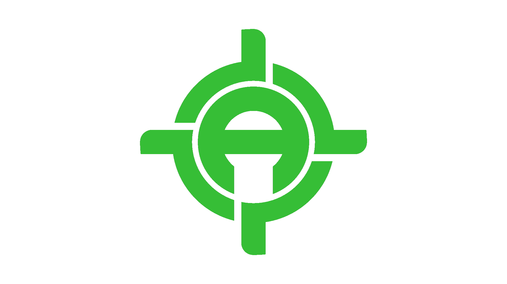
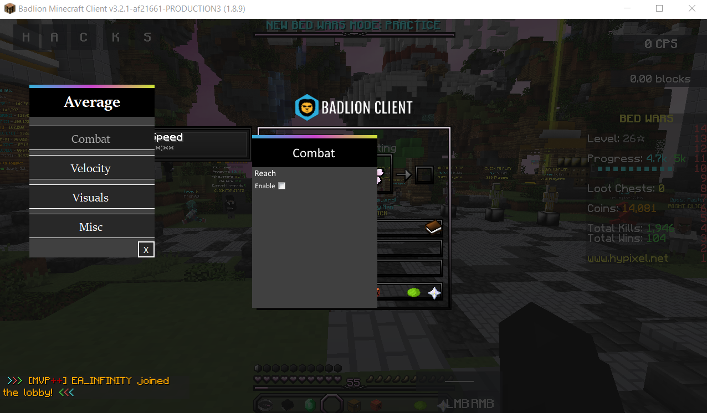

<!-- PROJECT LOGO -->
 

  

  <h3 align="center">Portofolio of Ysku</h3>

  

    Languages: C++/C#/Python ( + HTML, PHP experience)
     
    <a href="https://github.com/Ysku1337?tab=repositories"><strong>Explore my repositories »</strong></a>
     
     
    <a href="https://github.com/Ysku1337/mydiscord/blob/main/README.md">My Discord</a>
    ·
    <a href="https://overpr1zed.xyz">Website (currently down)</a>
  

<!-- TABLE OF CONTENTS -->

  
Table of Contents

  <ol>
    <li>
      <a href="#about-me">About me</a>
    <li><a href="#contact">Contacts</a></li>

  </ol>

<!-- ABOUT THE PROJECT -->
## About me:

Average MC-External Project:
<a>

<a>
  
Hello, I'm Ysku | Robin and this up there is a project of me.
This project is a Minecraft external Hack Client, that bypasses the Anti-Cheat of Badlion.

My hobbys are coding, boxing and driving around with my moped.

I started coding 6 years ago, my first projects was little scripts and they weren't useful.

I decided to learn the Basics of C++ and watched Youtube tutorials and started from "Hello world" to more complex things

I also tried one year later to learn C#, because I enjoyed memory hacking. (memory.dll)

Before 3 Years I started to code things for games like CS:GO (ImGui), Minecraft (external C#) or APIs.

Now today, I'm more coding on Private stuff like a Minecraft external Cheat, CS:GO Internal for friends and me...
  
I'm pretty new to Github btw

~Ysku

<a href="https://github.com/Ysku1337/Ysku1337/blob/master/LICENSE.txt">License</a>

## Contact
Discord: - Ysku#6405
Telegram - @Yskuxd
